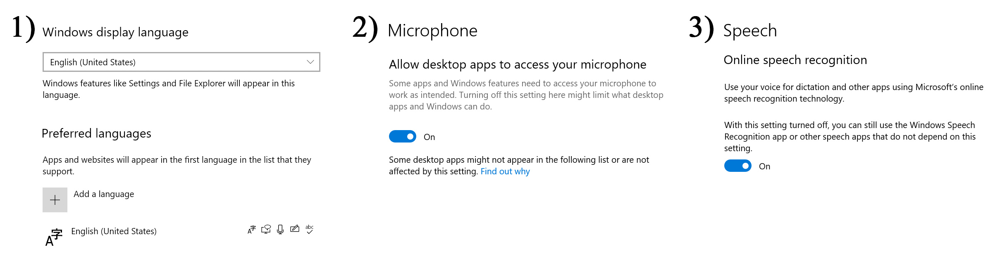

# Sociable - SoftFeather Games

# Playing
## Enable Microsoft Speech Recognition
- Windows 10
- Install the speech pack of your Windows display language (not necessarily English)
- Enable online speech recognition and allow access to the microphone.

- Install [FFmpeg](https://ffmpeg.org/download.html) and make it accessible via the `PATH` environment variable.


## Start Whisper
See installing everything above, open windows terminal and do the following:
```bash
cd "path/to/game/bsg-3_Data/StreamingAssets"
python -m venv venv
venv/Scripts/activate
pip install torch torchvision torchaudio --extra-index-url https://download.pytorch.org/whl/cu116
pip install openai-whisper
copy "path/to/ffmpeg.exe"
python whisper_sr.py
```
Note 1: If a python installer gets opened with `python -m venv venv`, you can safely install this in the shop.
Note 2: Whisper can be stopped with `Ctrl C`.


# Developing
## Full Functionality Development
### Unity
We use Unity 2021.3.15f1, the latest [LTS](https://unity.com/releases/editor/qa/lts-releases) release. In fact any version later than 2021.3 should work, you only have to modify the version in `ProjectSettings/ProjectVersion.txt`.


### Whisper
0. Install [Python](https://www.python.org/downloads). We only tested on 3.8.10 but it should support up to 3.10.
1. Install [PyTorch](https://pytorch.org/get-started/locally), preferably the version with CUDA.
2. Install [Whisper](https://github.com/openai/whisper).
3. Install [FFmpeg](https://ffmpeg.org/download.html) and make it accessible via the `PATH` environment variable.

Example setup on Windows
```bash
cd "path/to/game/Assets/StreamingAssets"
python -m venv venv
venv/Scripts/activate
pip install torch torchvision torchaudio --extra-index-url https://download.pytorch.org/whl/cu116
pip install openai-whisper
copy "path/to/ffmpeg.exe" .
python whisper_sr.py
```


## Script Debugging Only
If you are solely debugging the scripts, then what you only need is Unity. None of the language pack / microphone access / speech recognition / Whisper stuff is required. After cloning the repository, go to Edit > Project Settings > Player > Other Settings > Script Complication > Scripting Define Symbols, add `SCRIPT_JSON_DEBUG_ONLY` and start debugging.
